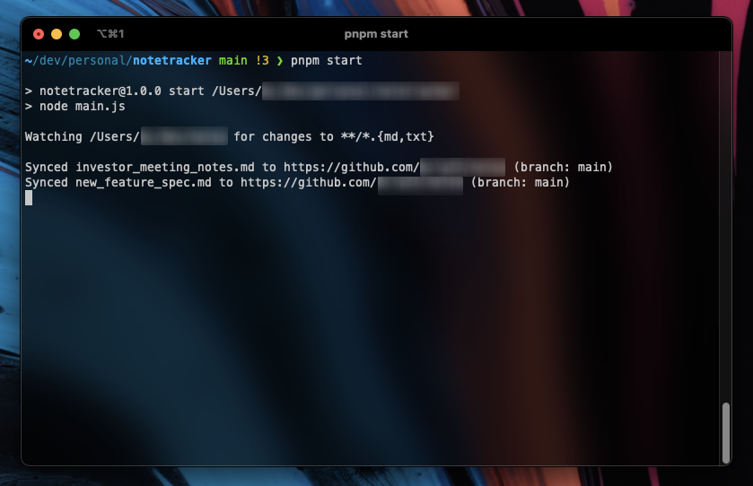

# Notesync 

**Notesync** uses a glob pattern to watch a local directory for file changes, and auto-commits them to a Git repo. 

## Motivation 

I regularly take notes in Markdown when I work, but keeping them synced between multiple machines is tricky.  Sure, I could use Apple Notes, or Evernote, or Onenote... but where's the fun in that?

## Using Notesync 

You'll need:
- Node.js runtime (20.x recommended)
- A Github personal access token [(create one here)](https://docs.github.com/en/authentication/keeping-your-account-and-data-secure/managing-your-personal-access-tokens)
- A Github repo to store your notes in

Getting Started:
- Clone this repo: 
  ```sh
  git clone git@github.com:bcla22/notesync.git
  ```
- Install dependencies with either npm, yarn or pnpm (recommended)
  ```sh
  pnpm install
  ```
- Create a `.env` file in the root directory with the following keys:
  ```properties
  REPO_DIR=/Users/youruser/dev/notes
  GIT_TOKEN=github_pat_11AF1EMP...
  ```
- By default, this script will watch `.md` and `.txt` files.  To change this, update the glob pattern in [main.js](./main.js).
- Run the start script to start watching the directory.
  ```sh
  pnpm start
  ```

  


## Outstanding TODOs

- Fix force-pull on start (inconsistent behaviour with unlinked files/dirs)
- Move from `.env` config to command-line arguments?

